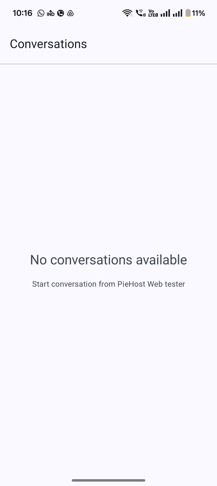
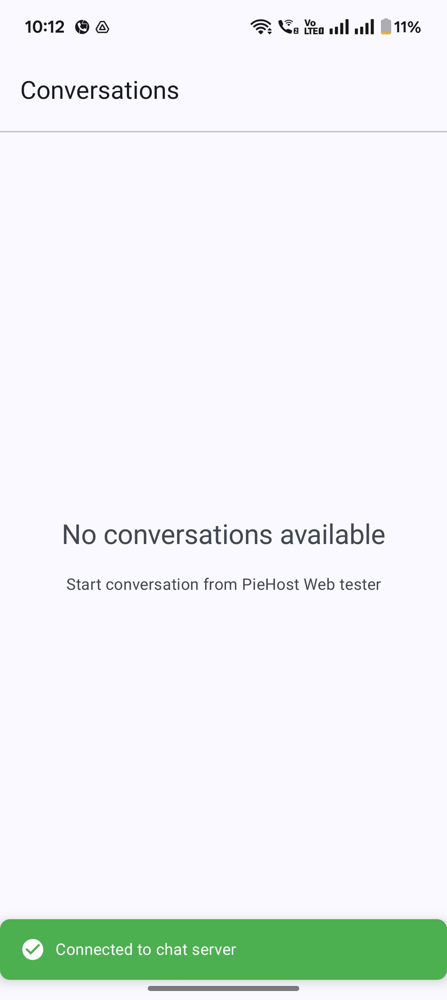
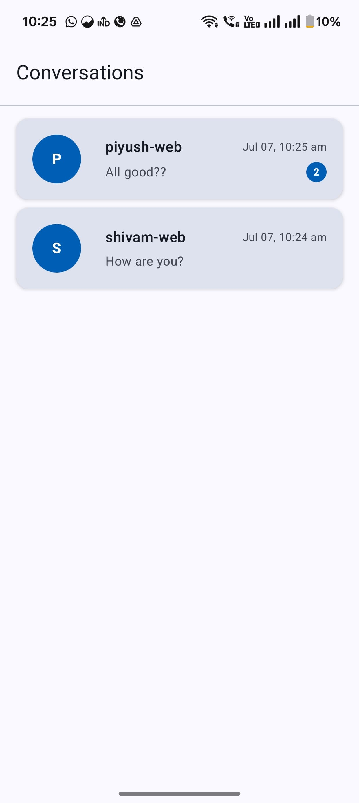
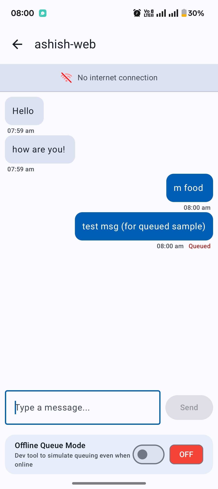
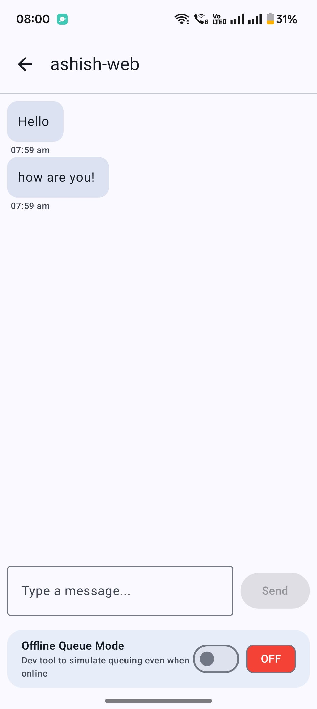
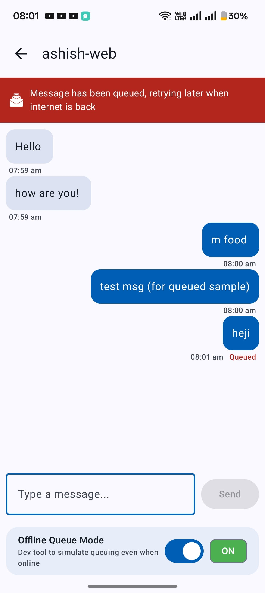
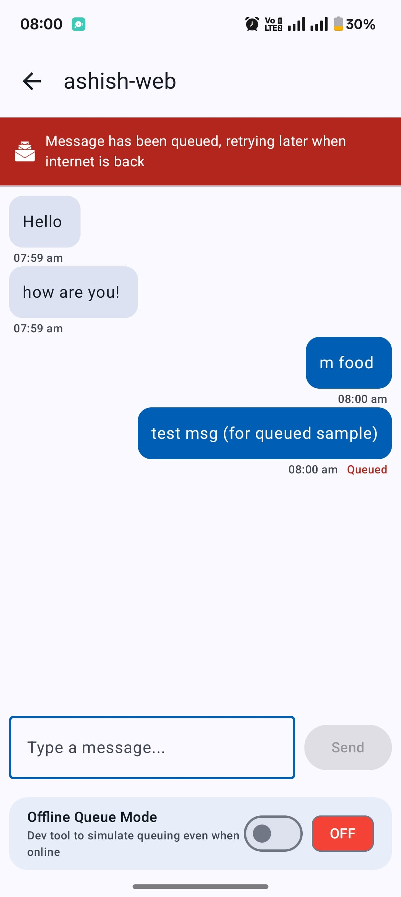
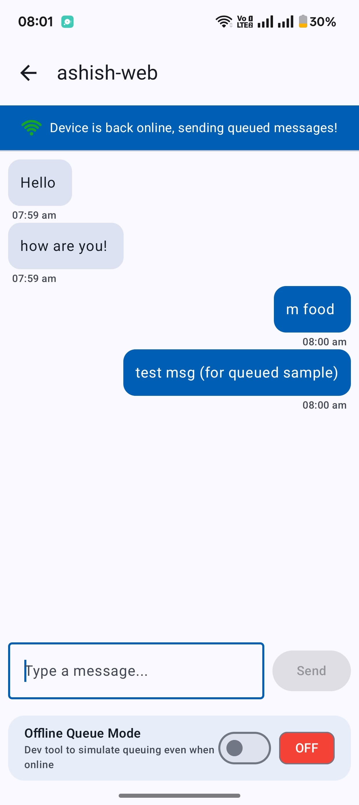

**PieChatApp** is a chat application built for Android that supports real-time communication with **Offline functionality**. 

---

📱 Download APK

https://github.com/shivamsharma-1996/PieChatApp/raw/main/apk/pie-chat-app.apk

---
## ✨ Features

💬 Real-Time Messaging: Socket-based communication using [PieHost-android-client](https://piehost.com/docs/3.0/android-websocket)

🔄 Offline Functionality: Message queuing and auto-retry when back online

📊 Chat Previews: Display latest message previews for each conversation

🔔 Unread Messages: Visual indicators for unread message count

🚫 Error Handling: Comprehensive error states and network failure alerts

📵 Empty States: Proper handling for no conversations and no internet scenarios

🔄 Auto-Retry: Intelligent message retry mechanism

---

## 🖼️ Screenshots

  <table>
    <tr>
      <td></td>
      <td></td>
      <td></td>
      <td></td>
    </tr>
    <tr>
      <td></td>
      <td></td>
       <td></td>
      <td></td>
    </tr>
  </table>

---

## 🔧 Tech Stack & Dependencies

- **Language:** Kotlin
- **Architecture:** MVVM + Clean Architecture + SOLID Principles
- **UI:** Jetpack Compose, Material Design Components
- **Real-Time Communication:** Socket.IO
- **Async Operations:** Kotlin Coroutines + Flow
- **DI:** Dagger-hilt
- **Other Libraries:** Navigation-compose
---

**Setup**
 Signup on PieHost [dashboard](https://piehost.com/). Create a free PieSocket project which will provide a websocket URL. Both Android and web client will connect to the same websocket URL with same room-id. 

 ---
📱 Usage
**Online Mode**
1. Connect both Android-client and [PieHost Web client](https://piehost.com/websocket-tester) to the same websocket URL.
2. Initiate the conversation from Web. Checkout the valid payload structure in this doc below.
3. Chat list displays all conversations
4. Tap on any chat to view/send messages
5. Messages are sent in real-time via socket connection

**Offline Mode**
1. When network is unavailable, messages are queued locally
2. Visual indicators show pending messages
3. Once network is restored, queued messages are automatically sent
4. Chat remains functional with local message history
---

**Payload Strucutre for PieHost Web client**
``{
  "event": "new-message",
  "data": {
    "sender_name": "shivam-web",
    "message": "Hi!"
  }
}``

   
