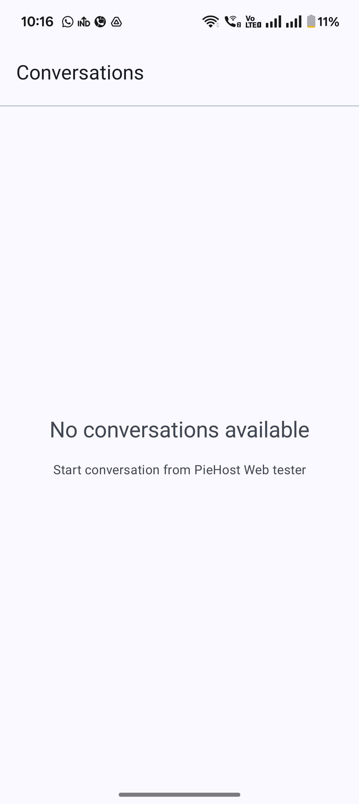
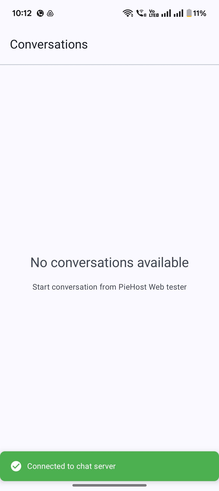
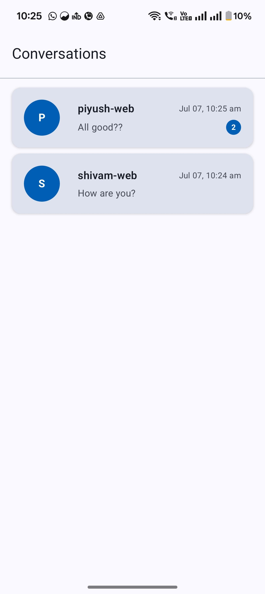
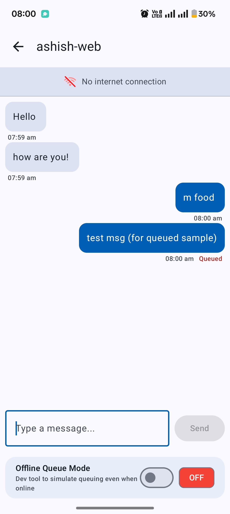
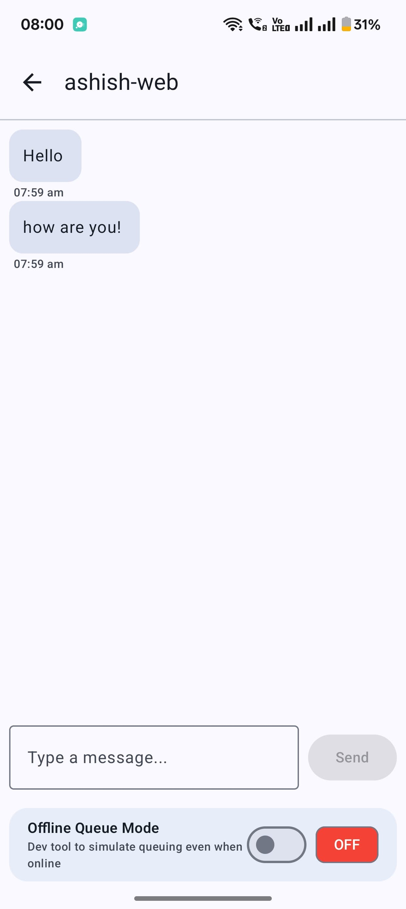
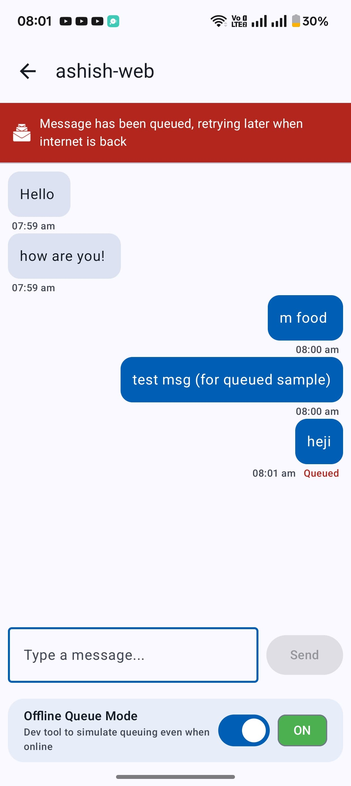
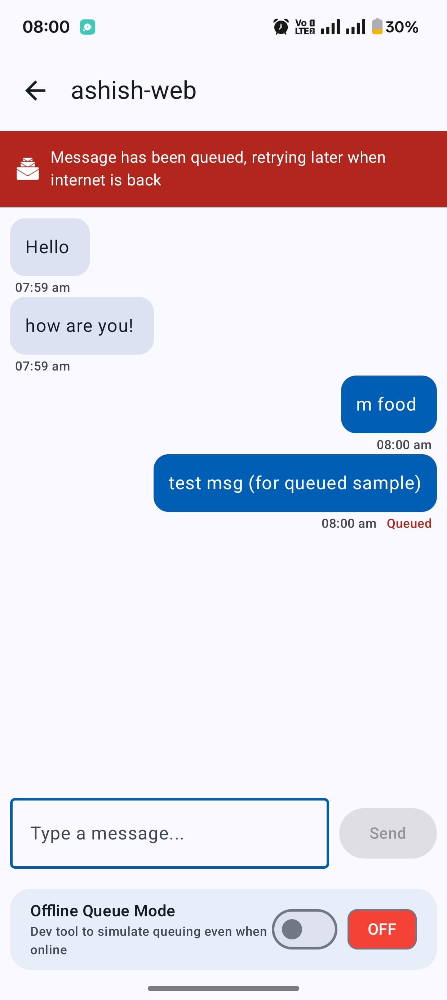
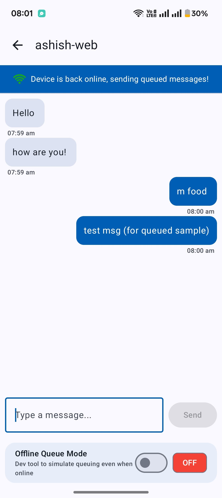

## 💬 PieChatApp

PieChatApp is an Android chat application that supports real-time messaging via sockets along with offline message queuing functionality.

---

## 📚 Table of Contents

1. [💬 Project Overview](#-piechatapp)
2. [📱 Download APK](#-download-apk)
3. [🎥 Demo Video](#-project-demo)
4. [✨ Features](#-features)
5. [🖼️ Screenshots](#-screenshots)
6. [📌 Tasks & Pull Requests](#-tasks--pull-requests)
7. [🔧 Tech Stack & Dependencies](#-tech-stack--dependencies)
8. [⚙️ Setup Instructions](#-setup)
9. [📱 Usage Guide](#-usage)
   - [🔛 Online Mode](#online-mode)
   - [📴 Offline Mode](#offline-mode)
10. [📤 Web Client Payload Format](#-payload-structure-for-piehost-web-client)

---

## 📱 Download APK

Click below to install the app on your Android device:

🔗 [Download APK](https://github.com/shivamsharma-1996/PieChatApp/raw/main/apk/pie-chat-app.apk)

---

## 🎥 Project Demo

Watch the demo video for a walkthrough of the project and its features:

https://github.com/user-attachments/assets/8c34505a-33d2-4cfc-8e1f-d46554147505

---

## ✨ Features

- 💬 **Real-Time Messaging**: Socket-based communication using [PieHost-android-client](https://piehost.com/docs/3.0/android-websocket)
- 🔄 **Offline Functionality**: Message queuing and auto-retry when back online
- 📊 **Chat Previews**: Display latest message previews for each conversation
- 🔔 **Unread Messages**: Visual indicators for unread message count
- 🚫 **Error Handling**: Comprehensive error states and network failure alerts
- 📵 **Empty States**: Proper handling for no conversations and no internet scenarios
- 🔁 **Auto-Retry**: Intelligent message retry mechanism

---

## 🖼️ Screenshots

<div align="center">
  <table>
    <tr>
      <td></td>
      <td></td>
      <td></td>
      <td></td>
    </tr>
    <tr>
      <td></td>
      <td></td>
       <td></td>
      <td></td>
    </tr>
  </table>
</div>


---

## 📌 Tasks & Pull Requests

| Task Name                           | Pull Request Title                                                                                                                                  |
| ----------------------------------- | --------------------------------------------------------------------------------------------------------------------------------------------------- |
| `initial-setup`                     | [Feat] [Initial project setup and base structure](https://github.com/shivamsharma-1996/PieChatApp/pull/1)                                           |
| `feat/navigation-architecture`      | [Feat] [Navigation Architecture](https://github.com/shivamsharma-1996/PieChatApp/pull/2)                                                            |
| `feat/implement-p0-domain-layer`    | [Feat] [Implement domain layer for conversations](https://github.com/shivamsharma-1996/PieChatApp/pull/3)                                           |
| `feat/integrate-piesocket-sdk`      | [Feat] [Integrate PieSocket SDK](https://github.com/shivamsharma-1996/PieChatApp/pull/4)                                                            |
| `feat/conversation-logic`           | [Feat] [Implement Conversation logic to observe all conversations](https://github.com/shivamsharma-1996/PieChatApp/pull/5)                          |
| `feat/chat-ui-logic`                | [Feat] [Implement chat UI and message handling logic](https://github.com/shivamsharma-1996/PieChatApp/pull/6)                                       |
| `refactor/chat-ui`                  | [Refactor] [Restructure data classes and refactor Chat UI handling](https://github.com/shivamsharma-1996/PieChatApp/pull/7)                         |
| `feat/offline-queue`                | [Feat] [Offline Message Queue Management System](https://github.com/shivamsharma-1996/PieChatApp/pull/8)                                            |
| `feat/ui-alert-handling`            | [Feat] [Add alert handling for UI state changes](https://github.com/shivamsharma-1996/PieChatApp/pull/9)                                            |
| `feat/queue-mode-simulation-toggle` | [Feat] [Implement Queue Mode Simulation Toggle](https://github.com/shivamsharma-1996/PieChatApp/pull/10)                                            |
| `feat/mark-as-read`                 | [Feat] [Implement unread count logic & mark conversation read on navigation to Chat Inbox](https://github.com/shivamsharma-1996/PieChatApp/pull/11) |

---

## 🔧 Tech Stack & Dependencies

- **Language:** Kotlin
- **Architecture:** MVVM + Clean Architecture + SOLID Principles
- **UI:** Jetpack Compose, Material Design Components
- **Real-Time Communication:** [PieSocket SDK](https://piehost.com/docs/3.0/android-websocket)
- **Async Operations:** Kotlin Coroutines + Flow
- **DI:** Dagger-Hilt
- **Other Libraries:** Navigation-Compose

---

## ⚙️ Setup

1. Sign up on the [PieHost dashboard](https://piehost.com/)
2. Create a free PieSocket project to get a WebSocket URL
3. Use the **same WebSocket URL and room ID** (`chat-shivam`) for both Android and Web clients

---

## 📱 Usage

### 🔛 Online Mode

1. Connect both the Android client and [PieHost Web client](https://piehost.com/websocket-tester) to the WebSocket URL:

```
wss://s14881.blr1.piesocket.com/v3/chat-shivam?api_key=XuGHlUqVmqBDlHxSP9Sn5hXKGCD6DohwYe62IxE9&user=some_user_name
```

- Replace `some_user_name` with a unique identifier like `shivam-web`.

2. Initiate the conversation using the [payload structure]((#-payload-structure-for-piehost-web-client)) below.
3. The conversations page will display previews for all active conversations.
4. Tap on any chat to view or send messages.
5. Messages are exchanged in real time over the socket.

### 📴 Offline Mode

1. When offline, outgoing messages are queued locally.
2. Visual indicators highlight pending messages.
3. Once back online, messages are automatically sent.
4. Local message history remains accessible.

---

## 📤 Payload Structure for PieHost Web Client

```json
{
  "event": "new-message",
  "data": {
    "sender_name": "shivam-web",
    "message": "Hi!"
  }
}
```

